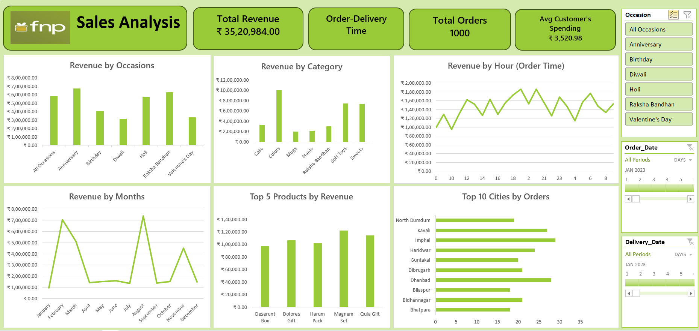

# 🌸 Ferns and Petals (FNP) — Sales Analysis Dashboard (2023)

---

## 🚀 Executive Snapshot (Quick View)

- 💰 Revenue: ₹35.2L  
- 🛍️ Orders: 1,000  
- 📦 Avg Order Value: ₹3,521  
- 🚚 Avg Delivery Time: 5.53 days  
- 📈 Peak Month: August  
- 🎯 Top Occasion: Anniversary  
- 🏆 Top Product: Magnam Set  

---

## 📌 Project Overview

This project analyzes sales data from FNP (Ferns and Petals) to extract actionable insights on customer behavior, product performance, and operational efficiency.

The analysis was performed using **Microsoft Excel** and presented through an interactive dashboard for business decision-making.

---

## 📊 Dashboard Preview

---

## 📈 Business Insights (Story Layer)

### 📅 1. Seasonal Demand Behavior
Sales show strong seasonality rather than uniform distribution.

- Peak demand: August, February  
- Lowest demand: January  

**Insight:** Revenue is strongly influenced by festival and occasion cycles.

---

### 🎁 2. Occasion-Driven Revenue Model
Customer purchases are event-centric.

- Anniversary → highest revenue contributor  
- Raksha Bandhan → second highest  

**Insight:** Business performance is highly dependent on recurring personal and cultural events.

---

### 📦 3. Product Concentration Effect
Revenue is not evenly distributed across products.

Top products:
- Magnam Set  
- Quia Gift  
- Dolores Gift  

**Insight:** A small subset of products drives a large share of revenue (Pareto-like behavior).

---

### 🚚 4. Delivery Performance Stability
- Average delivery time: 5.53 days  
- Slight increase with higher order volumes  

**Insight:** Operational system is stable but shows mild load sensitivity.

---

### 🌍 5. Geographic Distribution
- Orders spread across multiple cities  
- Strong participation from Tier-2 cities  

**Insight:** Demand is geographically decentralized, not metro-dependent.

---

## ⚙️ Methodology (Technical Summary)

- Cleaned and validated 1,000-order dataset  
- Engineered features (Month, Delivery Time)  
- Aggregated data using pivot tables  
- Built interactive dashboard with slicers and filters  

---

## 🛠️ Tools & Technologies

- Microsoft Excel  
  - Pivot Tables  
  - Charts & Dashboards  
  - Slicers  
  - Conditional Formatting  

---

##  Core Skills Demonstrated

- Microsoft Excel → Data Analysis & Dashboarding  
- Pivot Tables → Data Aggregation  
- Slicers → Interactive Filtering  
- Data Visualization → Business Insights  

## 📊 Analytical Design Principles

- KPI-first structure for rapid interpretation  
- Separation of metrics vs insights  
- Minimal redundancy across sections  
- Scannable hierarchy for recruiters  
- Story-driven interpretation layer  

---

## ⚠️ Limitations

- Dataset size limited to 1,000 records  
- Analysis is descriptive, not predictive  
- Seasonality interpretation is observational  

---

## 🚀 Future Improvements

- Sales forecasting model  
- Customer segmentation (RFM analysis)  
- Statistical correlation analysis  
- Migration to Microsoft Power BI for advanced analytics  

---

## 🖥️ How to View the Dashboard

1. Download the file `fnp_Sales_Analysis_Excel_.xlsx`  
2. Open it in **Microsoft Excel** (Excel 2016 or later recommended)  
3. Navigate to the **Dashboard** sheet  
4. Use slicers (Occasion, Month) to filter interactively  

---

## 👤 Author

Minna Nourin
Data Analyst | Excel | SQL | Power BI  

- LinkedIn: https://www.linkedin.com/in/minnanourin/

---

## 📄 License

This project is for educational and portfolio purposes only.  
Dataset belongs to FNP (Ferns and Petals) and is used here for analytical practice.
